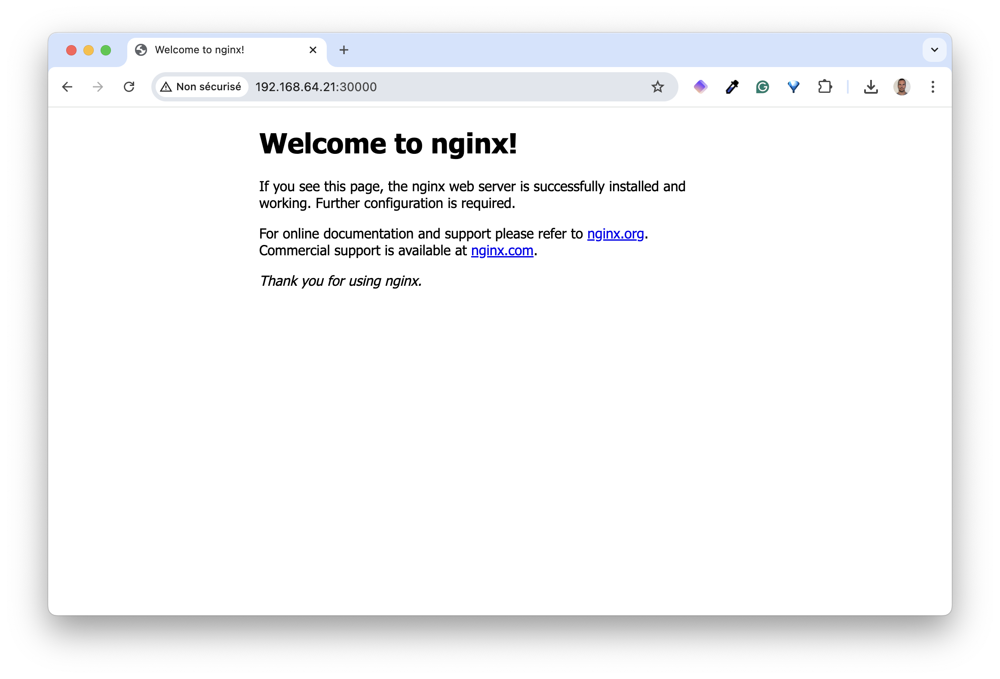

In this part, you will create a VM and run a single-node k0s on that one.

## Create the virtual machine

First, run the following command to launch a VM named *k0s*:

```bash
multipass launch -n k0s-1 --disk 10G --cpus 2 --memory 2G
```

Next, run a shell on that VM.


This will use the `ubuntu` user


```bash
multipass shell k0s-1
```

## Create the cluster

First, from this shell, get the latest release of k0s.

```bash
curl -sSf https://get.k0s.sh | sudo sh
```

After a few tens of seconds, the k0s binary will be available in `/usr/local/bin`. Check the current version.

```bash
k0s version
```

This command returns a version like `v1.33.4+k0s.0` (your version could be slightly different though, depending on when you're following this workshop).

Next, use the following command to create a systemd unit file.

```bash
sudo k0s install controller --single
```


When installing k0s we can provide the following options:

- `--single` allows to configure the instance as both a control-plane and a worker Node
- `--worker` allows to configure the instance as a worker Node

If none of these option is provided, the instance will act as a control-plane only Node. 


Next, start the cluster.

```bash
sudo k0s start
```

Then, after a few tens of seconds, verify the cluster is running properly.

```bash
sudo k0s status
```

You should get an output similar the following one.

```yaml
Version: v1.33.4+k0s.0
Process ID: 1817
Role: controller
Workloads: true
SingleNode: true
Kube-api probing successful: true
Kube-api probing last error: 
```

It takes a few tens of seconds for the cluster to be up and running. After this slight delay, you can verify that the k0s controller is started in systemd.

```bash
$ sudo systemctl status k0scontroller
● k0scontroller.service - k0s - Zero Friction Kubernetes
     Loaded: loaded (/etc/systemd/system/k0scontroller.service; enabled; preset: enabled)
     Active: active (running) since Tue 2025-09-16 23:08:10 CEST; 1min 58s ago
       Docs: https://docs.k0sproject.io
   Main PID: 1817 (k0s)
      Tasks: 108
     Memory: 583.4M (peak: 711.4M)
        CPU: 16.004s
     CGroup: /system.slice/k0scontroller.service
     ...
```

## Communication from an external machine

As k0s comes with its own *kubectl* subcommand, you can communicate with the API Server directly from the Node (the `k0s-1` VM you have created):

```bash
$ sudo k0s kubectl get node
NAME   STATUS   ROLES           AGE   VERSION
k0s-1  Ready    control-plane   11m   v1.33.4+k0s
```

Usually do not SSH into a cluster's Node to run kubectl commands, but run these commands from an admin machine. In order to do so, run the following command from your local machine. It retrieves the kubeconfig file generated during the cluster creation (`/var/lib/k0s/pki/admin.conf`) and saves it in a local file named `k0s.kubeconfig`.

```bash
multipass exec k0s-1 -- sudo cat /var/lib/k0s/pki/admin.conf > k0s.kubeconfig
```

Next, replace `localhost` with the actual IP address of the Multipass VM.

```bash
K0S1_IP=$(multipass info k0s-1 | grep IP | awk '{print $2}')
sed -i'' "s/localhost/$K0S1_IP/" k0s.kubeconfig
```

Then, configure your local *kubectl*, so it uses this modified kubeconfig file.

```bash
export KUBECONFIG=$PWD/k0s.kubeconfig
```

You can now communicate with the newly created cluster from your machine. List the Nodes to make sure this is working properly.

```bash
$ kubectl get no
NAME   STATUS   ROLES           AGE   VERSION
k0s-1  Ready    control-plane   16m   v1.33.4+k0s
```

## Testing the whole thing

Let's now run a Deployment based on the `nginx` image and expose it though a NodePort Service.

```bash
cat<<EOF | kubectl apply -f -
apiVersion: apps/v1
kind: Deployment
metadata:
  name: nginx
spec:
  selector:
    matchLabels:
      app: nginx
  template:
    metadata:
      labels:
        app: nginx
    spec:
      containers:
      - name: nginx
        image: nginx:1.26
        ports:
        - containerPort: 80
---
apiVersion: v1
kind: Service
metadata:
  name: nginx
spec:
  selector:
    app: nginx
  type: NodePort
  ports:
  - port: 80
    targetPort: 80
    nodePort: 30000
EOF
```

Make sure the resources have been created correctly.

```bash
kubectl get deploy,po,svc
```

You should get an output similar to the following one.

```bash
NAME                    READY   UP-TO-DATE   AVAILABLE   AGE
deployment.apps/nginx   1/1     1            1           32s

NAME                         READY   STATUS    RESTARTS   AGE
pod/nginx-65dd7588fc-4nmwr   1/1     Running   0          32s

NAME                 TYPE        CLUSTER-IP       EXTERNAL-IP   PORT(S)        AGE
service/kubernetes   ClusterIP   10.96.0.1        <none>        443/TCP        6m56s
service/nginx        NodePort    10.110.235.193   <none>        80:30000/TCP   6s
```

Using `k0s-1` IP address (`192.168.64.22` in this example) and the NodePort 3000, we can access nginx.



In the next part, we'll modify the default configuration.

